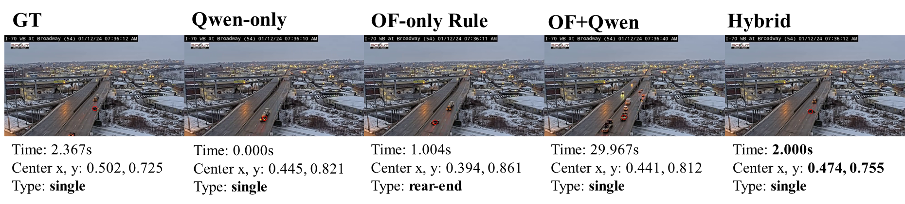
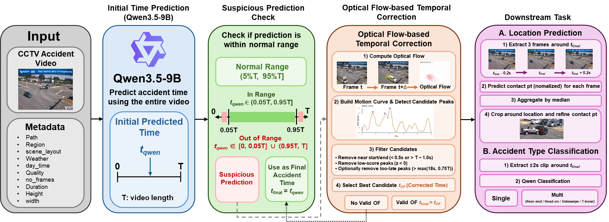

# ACCIDENT @ CVPR: Zero-Shot CCTV Accident Analysis

This repository contains a research project for **ACCIDENT @ CVPR 2026**, a zero-shot CCTV traffic accident analysis challenge.

The task is to predict:

* **When** the accident happens
* **Where** the accident occurs in the frame
* **What type** of collision occurs

Our project explores a zero-shot accident analysis pipeline using **Vision-Language Models (VLMs)** and **selective optical-flow-based temporal correction**.

---

## Overview

<p align="center">
  
</p>

CCTV-based traffic accident understanding is challenging because real-world surveillance videos often contain:

* Distant viewpoints
* Low visual quality
* Occlusions
* Short and subtle collision moments
* Complex vehicle motion before and after impact

We build a zero-shot pipeline based on **Qwen3.5-9B**.
The model first predicts the accident time from the full CCTV video and metadata, then predicts the collision location and accident type using targeted clips around the predicted accident time.

However, we observed that VLMs often suffer from **boundary-biased temporal hallucination**.
When fine-grained temporal evidence is unclear, the model tends to predict the accident time near the beginning or end of the video.

To mitigate this issue, we introduce **Selective Hybrid Temporal Correction**, which uses optical-flow motion cues only when the VLM prediction appears suspicious.

---

## Pipeline

<p align="center">
  
</p>

The pipeline consists of four main stages:

1. **Initial Time Prediction**
   Qwen3.5-9B predicts the initial accident time from the full video and metadata.

2. **Suspicious Prediction Check**
   If the predicted time is too close to the video boundary, it is treated as a suspicious temporal prediction.

3. **Optical-Flow-based Temporal Correction**
   Optical flow is used to detect abrupt motion peaks and correct unreliable boundary-biased predictions.

4. **Downstream Prediction**
   Using the finalized accident time, the pipeline predicts:

   * Collision location
   * Accident type

---

## Method

### 1. Initial Time Prediction

The VLM receives the full CCTV accident video and metadata, then predicts the initial accident time.

The metadata includes information such as:

* Region
* Scene layout
* Weather
* Day time
* Video quality
* Duration
* Number of frames
* Frame size

---

### 2. Boundary-biased Temporal Hallucination

We found that the VLM often predicts accident time near the start or end of the video, especially when the accident moment is visually ambiguous.

This behavior is treated as **temporal hallucination** or **anchoring bias**.

A prediction is considered suspicious when it falls outside the normal temporal range:

```text
Normal range: (0.05T, 0.95T]
Suspicious range: [0, 0.05T] or (0.95T, T]
```

where `T` is the video duration.

---

### 3. Selective Hybrid Temporal Correction

Optical flow can capture abrupt motion changes, but it can also be noisy due to:

* Normal vehicle movement
* Camera shake
* Shadows
* Background traffic
* Post-accident motion

Therefore, we do not apply optical flow correction to every video.

Instead, optical flow is used **only when the VLM prediction is boundary-biased**.

The correction process is:

1. Compute dense optical flow between frames.
2. Build a global motion curve.
3. Detect candidate motion peaks.
4. Filter invalid peaks near boundaries or with trivial motion.
5. Select the best optical-flow candidate as the corrected accident time.

If no valid optical-flow candidate is found, the pipeline falls back to the original VLM prediction.

---

## Downstream Tasks

After finalizing the accident time, the pipeline performs two downstream tasks.

### Location Prediction

The pipeline samples three frames around the finalized accident time:

```text
t_final - 0.2s
t_final
t_final + 0.2s
```

The VLM predicts the primary collision contact point for each frame.
The predicted coordinates are aggregated using the median, then refined using cropped zoom-in images around the estimated collision area.

---

### Accident Type Classification

The pipeline extracts a short clip around the finalized accident time:

```text
[t_final - 2.0s, t_final + 2.0s]
```

The accident type is classified into one of the following labels:

* `single`
* `rear-end`
* `head-on`
* `sideswipe`
* `t-bone`

---

## Results

The hybrid method achieved the best ACCIDENT score among our tested strategies.

| Method       |      T ↑ |      S ↑ |      C ↑ |   ACCs ↑ |   Public |  Private |
| ------------ | -------: | -------: | -------: | -------: | -------: | -------: |
| Qwen-only    |     0.44 |     0.50 |     0.46 |     0.46 |     0.44 |     0.47 |
| OF-only Rule |     0.33 |     0.36 |     0.44 |     0.37 |     0.38 |     0.37 |
| OF + Qwen    |     0.38 |     0.45 |     0.45 |     0.43 |     0.41 |     0.43 |
| Hybrid       | **0.49** | **0.50** | **0.48** | **0.49** | **0.48** | **0.50** |

Compared with the Qwen-only baseline, the hybrid method improved leaderboard scores by:

* **+8.6%** on the public leaderboard
* **+6.3%** on the private leaderboard

---

## Key Idea

The main insight of this project is that **VLMs and optical flow have complementary strengths**.

* VLMs provide strong semantic reasoning.
* Optical flow provides low-level motion evidence.
* Optical flow alone is noisy.
* VLM predictions can hallucinate near video boundaries.
* Selective correction combines both only when correction is likely to help.

---

## Repository Structure

```text
.
├── code/       # Main code for the accident analysis pipeline
├── image/      # Overview and pipeline images
├── log/        # Experiment logs
├── result/     # Prediction results and outputs
└── README.md
```

---

## Related Materials

* Competition: [ACCIDENT @ CVPR](https://www.kaggle.com/competitions/accident/overview)
* Paper Title: *Selective Optical-Flow Correction for Zero-Shot CCTV Accident Analysis with Vision-Language Models*

---

## Keywords

* Vision-Language Models
* CCTV Accident Analysis
* Zero-Shot Video Understanding
* Optical Flow
* Temporal Localization
* Spatial Localization
* Accident Type Classification
* Temporal Hallucination
